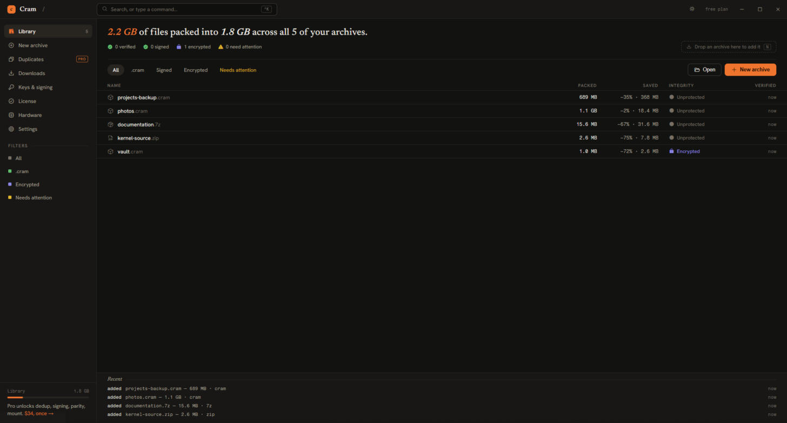
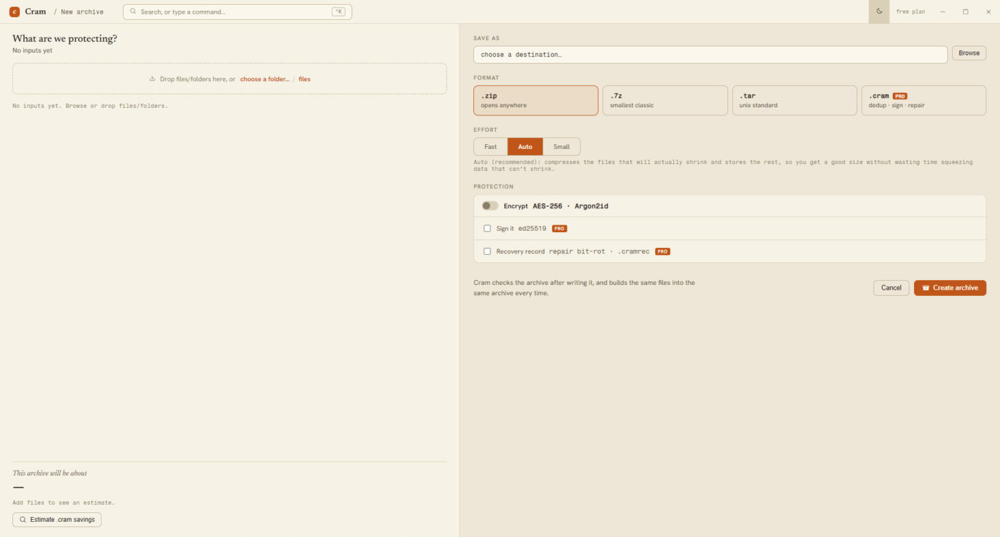

# Cram

A multi-format archive tool. One `cram` command lists, extracts, creates, tests, converts and mounts
archives, signs them, builds parity sidecars, and finds duplicate files across your drives. It also
has a native format (`.cram`) that stores repeated data once and losslessly repacks JPEGs.

**[Download](#download)** · [Benchmarks](BENCHMARKS.md) · [Roadmap](ROADMAP.md) ·
[Changelog](CHANGELOG.md) · [Limitations](#limitations)

<details>
<summary>Contents</summary>

- [Speed](#speed)
  - [Check it yourself](#check-it-yourself)
- [Download](#download)
- [Free, and a paid GUI](#free-and-a-paid-gui)
- [Formats](#formats)
- [Install](#install)
  - [Windows](#windows)
  - [Linux and macOS](#linux-and-macos)
  - [With cargo](#with-cargo)
  - [Building from source](#building-from-source)
- [Using it](#using-it)
  - [Command reference](#command-reference)
  - [Photos: ~23% smaller, and still byte-for-byte the same files](#photos-23-smaller-and-still-byte-for-byte-the-same-files)
  - [Downloading, and handing a browser download to Cram](#downloading-and-handing-a-browser-download-to-cram)
  - [Finding duplicates across drives](#finding-duplicates-across-drives)
  - [The Explorer right-click menu (Windows)](#the-explorer-right-click-menu-windows)
  - [What a damaged archive does](#what-a-damaged-archive-does)
- [Design notes](#design-notes)
- [Limitations](#limitations)
- [Cram Studio](#cram-studio)
- [Repository layout](#repository-layout)
- [Security](#security)
- [How this was built](#how-this-was-built)
- [License](#license)

</details>

## Speed

Creating an archive from 2.8 GB and 42,151 files, on a 24-thread Ryzen 9 5900X, median of two runs.

| | create | archive | peak memory |
|---|---|---|---|
| **Cram** `--auto` | **6.95 s** | 1.99 GB | 2.6 GB |
| 7-Zip 26.01 `-mx=5 -mmt=24` | 68.25 s | 2.30 GB | 7.1 GB |
| WinRAR 7.12 `-m3 -mt24` | 53.25 s | 2.38 GB | 0.3 GB |
| WinRAR 7.12 `-m5 -s -mt24` | 86.78 s | 1.99 GB | 0.6 GB |

**Measured 16 August 2026** on `cram 1.1.0`, commit `a84d77d`, built with the feature set the
releases ship (`download,zstd-c,phash,mimalloc`): Ryzen 9 5900X, 24 threads, 23 GiB of RAM, Ubuntu
24.04, archives written to ext4 on a dedicated volume. One machine, one afternoon. `cargo install
cram-cli` gives a default build with no `zstd-c`, which writes XZ packs where the shipping build
writes zstd, so it will not reproduce this table.

Both competitors are given every thread explicitly; Cram sizes its own from the machine. The first
three rows are each tool at its own default effort. RAR gets a fourth row because 7-Zip is solid by
default and RAR is not: `-m5 -s` is where RAR reaches Cram's ratio, and it is there so the size
comparison is not decided by one switch.

**9.8× faster than 7-Zip's default, writing 13.4% less.** Against RAR's default, 7.7× faster and
16.3% smaller. Against RAR at `-m5 -s`, where the two archives are 0.12% apart in size, 12.5×
faster. At `--fast` Cram writes the same corpus in 2.45 s, 28× 7-Zip's default, and still 12.3%
smaller than 7-Zip's output.

The memory column goes both ways. On create, Cram is lighter than 7-Zip on three of the four corpora
and 0.9% heavier on the fourth, Silesia, at 915 MB against 907 MB. On extraction it ranges from 3.8×
lighter, 1271 MB against 4877 on this corpus, to 86% heavier, 475 MB against 255 on Silesia. Against
a tar pipe, which holds nothing, it is heavier everywhere. The extraction figures are peak RSS while
reading, not the create column above.

**Both columns depend on your data, and not equally.** This corpus is 15% duplicate content by
construction, which `.cram` stores once and no setting on either competitor can collapse. On
Silesia, enwik9 and a kernel checkout, where there is little to deduplicate, Cram writes 9.2% to
19.2% *larger* than 7-Zip's default instead of 13.4% smaller. Speed moves much less: 6.0× to 11.4×
across all four corpora.

The kernel checkout carries more redundancy than a file-level scan finds. 634 of its 94,778 files
are byte-identical copies, 0.20% of the tree, and `cram --store`, which compresses nothing, still
writes 2.09% less than went in. The other 1.89% is redundancy inside files.

**That table is Cram's own format. On `.zip`, the one people actually exchange, the gap is
parallelism rather than deduplication.** Reading a kernel-tree `.zip`, Cram takes 1.89 s against
7-Zip's 7.21 and Info-ZIP's 9.65, because neither of them extracts a `.zip` on more than one core
even though every entry in the format is independently addressable. Writing one, 3.08 s against
13.61 and 28.37, for an archive 0.55% larger than 7-Zip's and 1.41% smaller than Info-ZIP's. It
costs memory: 150 MB against 31 and 4.9. Full table in
[BENCHMARKS.md](BENCHMARKS.md#zip-against-7-zip-and-info-zip).

### Check it yourself

The corpus is **[a 2.22 GiB download](https://drive.proton.me/urls/FYRM6FM454#zf8BLhcKK4ew)**,
2,800,604,582 bytes and 42,151 files unpacked:

```
sha256  5be1b545ec9535834904a6436e6abf27a0fd607190851e314624e8a2db53faa7
```

It also rebuilds itself byte for byte from public sources with `python3
tools/corpus/make-corpus.py`, so you do not have to trust the link or us: it carries its own
`MANIFEST.sha256` and a `CORPUS.id` to check against. `tools/corpus/bench-corpus.sh` re-runs the
whole table, and [`BENCHMARKS.md`](BENCHMARKS.md) states the method in full, including where Cram
loses. Those rows are in the same tables as the ones above.

## Download

Cram 1.1.0, from the [releases page](https://github.com/lukr54/cram/releases/latest):

| | |
|---|---|
| Windows | [`cram-latest-x86_64-pc-windows-gnu.zip`](https://github.com/lukr54/cram/releases/latest/download/cram-latest-x86_64-pc-windows-gnu.zip) |
| Linux (x86-64) | [`cram-latest-x86_64-unknown-linux-gnu.tar.gz`](https://github.com/lukr54/cram/releases/latest/download/cram-latest-x86_64-unknown-linux-gnu.tar.gz) |
| macOS (Apple Silicon) | [`cram-latest-aarch64-apple-darwin.tar.gz`](https://github.com/lukr54/cram/releases/latest/download/cram-latest-aarch64-apple-darwin.tar.gz) |
| Cram Studio, Windows GUI | [`cram-studio-latest-x64-setup.exe`](https://github.com/lukr54/cram/releases/latest/download/cram-studio-latest-x64-setup.exe) |
| Firefox hand-off add-on | [`cram-handoff-latest.xpi`](https://github.com/lukr54/cram/releases/latest/download/cram-handoff-latest.xpi) ([what it does](#downloading-and-handing-a-browser-download-to-cram), needs Studio) |

Every release publishes a `SHA256SUMS` for each platform. **Nothing is code-signed yet**, so Windows
SmartScreen warns on the first run of a downloaded binary and macOS keeps it quarantined until you
clear the flag. `cram update` replaces an existing install and verifies the published checksum
before it writes anything. The add-on is the exception: it is signed by Mozilla, because Firefox
will not install an unsigned one.

## Free, and a paid GUI

The engine and the `cram` command line are **MIT OR Apache-2.0**, and nothing in the command line is
held back: every format, every effort level, encryption, mounting, deduplication, recovery sidecars
and signing are in the free tool. That is not a trial and it does not expire.

**Cram Studio** is a Windows desktop app for people who would rather not use a terminal. It is a
separate proprietary product under its own EULA. The download is free and a Pro upgrade unlocks
some of its features; the command line is not affected either way. If the terminal suits you, you
do not need Studio at all.

This repository is the engine and the command line. It is written in Rust, and Windows (the
GNU/mingw toolchain), Linux and Apple Silicon macOS each build and run the full test suite. Archive
**mount** is Windows-only (see [Limitations](#limitations)). Everything is pure Rust **except three C
components**, all of which the released binaries carry: the UnRAR C++ decoder, always compiled in
because it is what reads RAR; the optional `zstd-c` feature, which links C libzstd; and the optional
`mimalloc` feature, which replaces the global allocator.

---

## Formats

| | ZIP | 7z | tar(.\*) | ISO 9660 | RAR | `.cram` |
|---|:-:|:-:|:-:|:-:|:-:|:-:|
| List / extract | ✅ | ✅ | ✅ | ✅ | ✅ | ✅ |
| Create | ✅ | ✅ | ✅ | ❌ | ❌ ✱ | ✅ |
| Test (integrity) † | CRC-32 / AES auth | CRC-32 if stored | decode | decode | decode | decode |
| Mount as a folder ‡ | on-demand | ≤ 2 GiB RAM | ≤ 2 GiB RAM | on-demand | ≤ 2 GiB RAM | on-demand |
| Encryption | AES-256 | AES-256 | ❌ | ❌ | read | AES-256-GCM |

`tar(.*)` covers plain tar plus gzip, xz, zstd, bzip2, lz4 and brotli. A **bare single-stream
compressed file** (`foo.gz`, `foo.xz`, `foo.zst`, `foo.bz2`, `foo.lz4`, `foo.br`) is read as a
one-entry archive; like tar it has no per-entry checksum, and mounting one goes through the same
in-RAM path as 7z/tar/RAR.

✱ Cram never *creates* RAR, and never will: the UnRAR licence forbids using its source to build a
RAR compressor. Cram reads RAR only.

† **`cram t` does not mean the same thing for every format.** *CRC-32*: the checksum stored in the
container is recomputed over the decoded bytes and compared, real content integrity. ZIP stores one
for every entry except a WinZip AES entry written in the **AE-2** form, which stores no
CRC because the AES authentication code already covers the data; those entries are checked against
that authentication code instead, which fails if any byte of the entry changed. In 7z the CRC field
is optional, so an entry carrying none falls back to the *decode* check. *decode*: Cram recomputes no
checksum of its own, so the check is "every entry decodes cleanly and its decoded length matches its
declared size", plus whatever the underlying decoder rejects. For `.cram`, encrypted packs are
additionally authenticated by their AES-GCM tag and compressed packs by their codec framing, an
unencrypted *stored* pack has neither. So `cram t` catches truncation, structural damage and broken
codec streams on every format, but a **silent in-file bit flip** is guaranteed to be caught only for
ZIP, for 7z entries that carry a stored CRC, and for compressed or encrypted `.cram`. See
[Limitations](#limitations).

‡ **Mount requires the optional Windows feature `Client-ProjFS`**, which is off by default. Enable it
from an elevated PowerShell:

```powershell
Enable-WindowsOptionalFeature -Online -FeatureName Client-ProjFS   # a restart may be required
```

The ProjFS DLL is bound lazily, so every other command works without the feature. *on-demand*:
content is read out of the archive as a file is opened, with no up-front extraction. *≤ 2 GiB RAM*:
7z, tar, RAR and bare compressed streams are **decoded whole into memory up front** and refuse
anything whose total uncompressed size exceeds 2 GiB, extract those instead. tar, RAR and bare
streams have no random-access hand-off point at all; 7z has one that extraction uses, but a small
ranged read through it still costs decoding from the start of a solid block, so it is not the
on-demand behaviour the column promises.

**The archive is never modified.** By default a mount is for reading: unmounting removes the mount
directory, so a file you edit inside it is discarded. If the folder ends up holding files that are
not in the archive, it is kept rather than deleted, and Cram says so.

`cram mount --writable` keeps them on purpose. The archive stays the immutable base and the mount
folder becomes everything that has diverged from it, so a program can write settings, saves and new
files into the mount and find them again next time. Re-mounting the same archive on the same folder
resumes over what is there: a modified file wins over the archive's copy, an untouched one still
comes from the archive, and a deleted one stays deleted. Nothing is ever written back into the
`.cram`; **deleting the mount folder is how you reset to a pristine archive**, and the only way,
since ProjFS has no way to un-tag a virtualization root.

**Bringing mounts back after a reboot.** A mount does not survive a restart: the folder and
everything written into it does, but the process serving the archive's files does not, so its
files list at the right sizes and fail to open until something re-mounts. Add `--remember` to a
mount and `cram mount --restore` brings it back, holding every remembered mount in one process.
`cram mount --list` shows what would come back and `--forget <dir>` drops one, leaving the folder
and its contents alone.

If Cram Studio is installed and set to start with Windows, it runs `--restore` for you at boot,
and only at boot: opening the Studio window by hand never re-mounts anything.

**Nothing is remembered unless you say so.** There is no setting that turns this on for
everything: an empty list is the default, `--remember` is the whole opt-in, and a machine that
never asked restores nothing. An encrypted archive is refused, since its password cannot be
stored and would have to be typed at every boot.

That last point matters for the case this was built for: a game archived once and mounted rather than
installed keeps its saves and config beside it, and the archive it reads from cannot be changed by
playing. It only captures writes that land *inside* the mount, so anything a program writes to
`%APPDATA%` or the registry still goes there.

Signing (`.cramsig`) and Reed-Solomon recovery (`.cramrec`) are sidecars computed over a file's bytes
and work on **any file**, not just Cram's own formats. The self-extracting `.exe` does not:
`make-sfx` checks the payload's magic and refuses anything that is not a `.cram`.

---

## Install

### Windows

[`cram-latest-x86_64-pc-windows-gnu.zip`](https://github.com/lukr54/cram/releases/latest/download/cram-latest-x86_64-pc-windows-gnu.zip),
or the versioned `cram-v1.1.0-x86_64-pc-windows-gnu.zip` from the
[releases page](https://github.com/lukr54/cram/releases/latest). Both are the same bytes; the
version-free name exists so a `releases/latest/download/…` link keeps working across releases, and
every platform now has one. `SHA256SUMS.windows` covers the versioned name, which is the one
`cram update` fetches and the single authoritative hash for the release.

The zip holds `cram.exe`, `cram-extract.exe`, `cram_shell.dll` (the Explorer right-click menu, which
does nothing until you run `cram shell install`) and `libwinpthread-1.dll`, which `cram.exe` links
against and will not start without. Keep the contents together. They are **not code-signed**, so
SmartScreen will warn on first run (see [Limitations](#limitations)).

`cram update` fetches the next release, checks it against the SHA-256 that release publishes, and
replaces itself. It refuses to install anything it cannot verify.

### Linux and macOS

The `cram` CLI runs on Linux x86-64 and on Apple Silicon macOS:

```sh
curl -fsSL https://raw.githubusercontent.com/lukr54/cram/main/install.sh | sh
```

The script resolves the newest release from the GitHub API and installs two binaries into
`~/.local/bin` (no root, no daemon, nothing else touched): `cram`, and `cram-extract`, which
`cram make-sfx` shells out to. Re-running it upgrades them.
Prefer to read before you pipe to a shell? Download [`install.sh`](install.sh), read it, then run it.
The tarball is also attached to each release if you'd rather place the binary yourself. Archive
**mount** (`cram mount`) is Windows-only (it uses ProjFS); every other verb works identically.

The macOS binaries are **not signed or notarised**, so a download is quarantined by Gatekeeper; 
`install.sh` clears that flag on the file it just fetched, and building from source avoids it
entirely. Drive detection there goes through `diskutil`, which matters because it is what decides
between one sequential reader and several parallel ones: getting it wrong on an external spinning
disk (where a large collection usually lives) causes seek thrash rather than speed.

### With cargo

```sh
cargo install cram-cli
```

**The crate is `cram-cli`.** `cargo install cram` installs an unrelated middleware library by another
author, which has held that name on crates.io since before this project existed.

That gives you the `cram` binary alone. `cram-extract`, which `cram make-sfx` shells out to, is a
separate crate (`cargo install cram-extract`), and the Explorer right-click DLL is not published to
crates.io at all; on Windows, take the zip above if you want all three.

### Building from source

Cram targets **`x86_64-pc-windows-gnu`** (WinLibs mingw / GCC). No MSVC toolchain is used or
required. The UnRAR C++ dependency needs the linker flags already configured in
[`.cargo/config.toml`](.cargo/config.toml).

The stock Windows rustup default is MSVC, which is **not** the configuration this ships as: the
linker flags in `.cargo/config.toml` are scoped to `x86_64-pc-windows-gnu`, so a default build
silently drops them and fails on `multiple definition of pthread_*`. Select the toolchain first:

```sh
rustup toolchain install stable-x86_64-pc-windows-gnu
rustup default stable-x86_64-pc-windows-gnu
cargo build --release -p cram-cli -p cram-extract -p cram-shell
```

CI pins the same target through `CARGO_BUILD_TARGET` rather than relying on the default.

That produces, in `target/release/`:

- **`cram.exe`**, the CLI.
- **`cram-extract.exe`**, a standalone `.cram` decoder and the self-extractor stub. Keep it beside
  `cram.exe`; `cram make-sfx` shells out to it and fails without it.
- **`cram_shell.dll`**, the Explorer right-click handler. `cram shell install` refuses to run
  without it beside `cram.exe`, which is why it is in the build line above.

Deploying either binary also needs `libwinpthread-1.dll` alongside it (it lives on the mingw PATH
during development).

On **Linux**, the toolchain is just a system C/C++ compiler (`build-essential`; g++ builds the UnRAR
dependency) and a stable Rust toolchain; there is no mingw and no bundled DLL. Build the same way:

```sh
cargo build --release -p cram-cli -p cram-extract
```

The downloader's TLS uses pure-Rust rustls on Linux, so the binary needs no system OpenSSL.

Optional features are opt-in, so the base build always compiles on a bare mingw toolchain:

| Feature | Effect |
|---|---|
| `zstd-c` | full-range zstd encoder (C libzstd), and the default `.cram` pack codec once enabled. Without it, `.cram` packs use pure-Rust XZ. |
| `download` | enables the `cram dl` segmented downloader. It is a client and opens no listening socket. |
| `phash` | perceptual image hashing, so `cram dedup --similar` can flag visually-alike photos. Pure Rust, but a large dependency tree, hence opt-in. |
| `mimalloc` | replaces the global allocator with mimalloc (C). Enabled in the released binaries. |

The released binaries are built with all four. That is also the configuration the benchmarks were
run in, so it is the one to build if you want to reproduce them:

```sh
cargo build --release -p cram-cli --features download,zstd-c,phash,mimalloc
```

`cram --version` prints which optional features a given binary was compiled with. A `zstd-c` build
writes different `.cram` bytes than the pure-Rust default, so it is worth checking before comparing
two archives.

Run the tests with `cargo test`; on 16 August 2026 that was 310 tests on Windows and 296 on Linux,
rising to 323 and 309 with the features the release is built with
(`download,zstd-c,phash,mimalloc`). Counts and platforms are in
[CONTRIBUTING.md](CONTRIBUTING.md#running-the-tests); they drift with every commit, and what matters
is that the suite is green.
`cargo fmt --all -- --check` and `cargo clippy --workspace --all-targets -- -D warnings` are clean.
See [CONTRIBUTING.md](CONTRIBUTING.md).

---

## Using it

```sh
cram a backup.cram ./project        # create (adaptive compression; --fast / --auto / --small)
cram l backup.cram                  # list
cram t backup.cram                  # test integrity (no extract; exits non-zero if bad)
cram x backup.cram -o ./out         # extract (--skip: see the note below)
cram conv backup.cram backup.zip     # convert to another format
cram mount backup.cram .\view        # mount as a virtual folder; press Enter to unmount
```

`cram a` writes a new archive. If a file of that name is already there it stops and changes nothing;
pass `--overwrite`, or `-y`, to replace it. `cram conv` and `cram make-sfx` guard their output the
same way.

### Command reference

```
cram l  <archive>                                 list entries
cram x  <archive> [-o <dir>] [-p <pw>] [--skip]   extract
cram a  <archive> <input...> [-p <pw>]            create [--fast|--auto|--small|--tiny|--store]
           [--solid|--no-solid] [--overwrite]     [--overwrite] replaces an existing <archive>
           [--recompress|--no-recompress]         [--recompress] repacks JPEGs losslessly; it is
                                                  already on at --small and --tiny, off at --auto
cram t  <archive> [-p <pw>]                       test integrity (decode + checksums, no extract)
cram conv <in> <out> [-p <pw>] [--encrypt <pw>]   convert to <out>'s format
           [--overwrite]                          [--fast|--auto|--small|--tiny|--store]
                                                  [--overwrite] replaces an existing <out>
cram dl <url…|FILE.meta4> [-o <out>] [--extract <dir>] [-n <conns>] [--chunk <mb>]
                                                  segmented download; several URLs are mirrors of
                                                  one file. --discover finds mirrors, --auto ramps
                                                  connections, --sha256 <hex> verifies. Needs a
                                                  build with the `download` feature.
cram dedup <folder|file…> [--similar]             find duplicate files across folders and drives.
           [--similar-distance <0-15>]            Previews by default; --link (hard-link) or
           [--link] [--quarantine <dir>]          --quarantine <dir>, each with --apply, reclaim
           [--apply] [--min-size <bytes>]         the space. --keep picks which copy survives
           [--keep shortest|oldest|first]         (default: the shortest path). --similar also
           [--json]                               flags visually-alike images for human review.
cram mount [--selftest] [-p <pw>] [--writable]    mount as a virtual folder (ProjFS). --writable
           [--remember] <archive> <dir>           keeps what you write into the folder; --remember
cram mount --restore | --list | --forget <dir>    records the mount so --restore brings it back
                                                  after a reboot, --list shows what would come
                                                  back, and --forget drops one.
cram rec <create|verify|repair> <file> …          Reed-Solomon recovery sidecar (.cramrec)
cram sign <file> -k <keyfile>                     write a detached ed25519 signature (.cramsig)
cram verify <file> [--key <hex>]                  verify a signature (pin --key to require a signer)
cram keygen <keyfile>                             create a signing key (prints its public key)
cram make-sfx <archive.cram> <out.exe>            build a self-extracting executable
           [--overwrite]                          [--overwrite] replaces an existing <out.exe>
cram shell <install|uninstall|status>             add or remove Cram's Explorer right-click menu
                                                  (Windows; writes under HKCU only, no elevation)
cram update [--check] [--force]                   download the latest published release, verify its
                                                  published SHA-256 and replace this install.
                                                  --check reports and changes nothing. Needs a
                                                  build with the `download` feature.
cram diag <status|on|off|report|where>            write a diagnostic file for a bug report
                                                  `report` produces a text file you can attach to
                                                  an email or an issue. Nothing is ever sent
                                                  anywhere. File and folder names are described by
                                                  shape, not included, so it is safe to attach in
                                                  public; --full-paths includes them if asked.
                                                  Detailed per-entry recording is off by default,
                                                  costs a little speed, and is turned on with
                                                  `diag on`
cram <any command> --diag-report                  write a report about that run, succeed or fail.
                                                  Timings and archive structure only exist while
                                                  the command runs, so this is how to report a
                                                  command that worked but was slow
cram --version                                    version + which optional features are compiled in
```

- `-p <pw>` supplies a password: to read an encrypted source, or to encrypt on create.
- `--skip` leaves a file alone when the destination already holds exactly that entry. A match has to
  be *proven* from a per-entry CRC stored in the container, so it takes effect on ZIP and 7z only; on
  tar, RAR, ISO, a bare compressed file and `.cram` there is no stored CRC to compare against and
  every entry is re-extracted as normal.
- `--encrypt-names` (7z and `.cram` only) hides the file listing as well as the contents.
- `--no-solid` (7z only) writes one independently-decodable pack per entry rather than packing
  members together. That gives up most of the ratio and buys a cheaper read of one member out of a
  large archive. Solid is the default; `--solid` states it explicitly for a script that would rather
  not rely on a default.
- `--overwrite`, alias `-y`, lets `cram a`, `cram conv` and `cram make-sfx` write over a file that
  already exists. Without it they refuse and exit non-zero, leaving the file as it was. `cram a` is
  spelled like 7-Zip's *add to archive* but creates a new one, which is the case the guard exists
  for.
- The format on create is chosen from the output extension (`.zip` / `.7z` / `.cram` /
  `.tar[.gz|.xz|.bz2|.lz4|.br|.zst]`).
- `cram l`, `cram x`, `cram t` and `cram conv` refuse an argument they do not recognise instead of
  ignoring it. `cram x bundle.zip src/a.txt` used to extract the whole archive, because selecting
  individual entries is not supported; it now fails and says why. An archive whose name starts with
  `-` is still read as the archive, and `--` before it states that explicitly.

### Photos: ~23% smaller, and still byte-for-byte the same files

Cram can repack JPEGs losslessly on the way into a `.cram`. A photo's data is already entropy-coded,
which is why zip and 7z gain essentially nothing on a photo library. Measured 2026-08-04 on one
folder of 34 phone photos (26.1 MB, 8 and 12 megapixel JPEGs): ZIP and 7z both produced output
*fractionally larger* than the originals, `tar.xz` managed 2.7%, and the same folder as a `.cram`
was **23.6% smaller** with every file extracting byte-identical. That is a single folder, not a
benchmark, and the harness is not in this repository; `cram a` prints the real ratio for your own
files.

Nothing is traded away for it. The JPEG's entropy coding is redone with a stronger coder, and
extraction reconstructs the **original file byte-for-byte**, same bytes, same EXIF, same checksum.
It is not "visually lossless"; it is the file you put in. Every candidate is verified to round-trip
*before* it is stored, and anything that fails verification is stored untouched, so the worst case is
that a file simply isn't shrunk.

It runs at `--small` and `--tiny`, or at any level with `--recompress`; `--no-recompress` overrides
it. **It is off at the default `--auto`**, so reaching the figure above takes one of those flags.
Archives that use it declare format v2
(see [docs/CRAM_FORMAT.md](docs/CRAM_FORMAT.md)), which older readers refuse outright rather than
misread, and the standalone `cram-extract` recovery tool reverses it too, so a photo archive stays
recoverable with the small independent decoder.

### Downloading, and handing a browser download to Cram

`cram dl` fetches a file over several connections at once, resumes where it stopped, and can
unpack it while it is still arriving:

```sh
cram dl "https://example.com/big.zip" -o D:\Downloads
cram dl "https://example.com/big.zip" --extract D:\Games\thing   # unpack as it downloads
cram dl "https://a.example/f.iso" "https://b.example/f.iso"      # two URLs = mirrors of one file
```

`--discover` looks for more mirrors, `-n` sets the connection count and `--auto` ramps it while
watching throughput, and `--sha256 <hex>` refuses the file unless it matches. A Metalink
(`FILE.meta4`) supplies the mirrors and the checksum on its own.

To use it on something you were about to download in Firefox: **right-click the link, Copy Link,
and pass it to `cram dl`.** That is the whole manual route, and it is worth knowing because the
per-connection resume and the extract-while-downloading are the parts you cannot get from the
browser.

**It will not work for a download that needs your session.** If the file sits behind a login, the
URL alone is not enough; the cookies are, and the browser will not hand those to another program.
A Firefox add-on does the hand-off properly, cookies included:
**[`cram-handoff-latest.xpi`](https://github.com/lukr54/cram/releases/latest/download/cram-handoff-latest.xpi)**.

**It needs Cram Studio.** The add-on talks to a native-messaging host that only the Studio installer
registers, so the command line on its own is not enough for this one feature. Install Studio first,
then in its Downloads pane tick *Accept downloads from your browser*. Click the link above in
Firefox and it will offer to install; afterwards, restart Firefox fully. A **Cram** button appears in
the toolbar and turns the automatic hand-off on and off. The right-click *Download with Cram* menu
works either way.

It is signed by Mozilla (id `cram-handoff@nexalit.fr`, version 1.0.0) but distributed **unlisted**,
so it has no page on addons.mozilla.org: this release is the only place to get it. Its checksum is
published as `SHA256SUMS.addon`, and Firefox checks Mozilla's signature on install regardless.

The add-on needs `cookies` and `<all_urls>` to do its job, which is a lot to ask for, so it is worth
being plain about why: it reads the cookies **for the URL you are downloading** in order to attach
them to Cram's own request, and it does that for any site because a download can start anywhere. It
declares `data_collection_permissions: none` to Mozilla, sends nothing anywhere, and talks only to a
native-messaging host on your own machine.

### Finding duplicates across drives

`cram dedup` answers a different question from the rest of the tool: how much of this pile is the
same file twice. It is aimed at the case where a large collection has
accreted over years and drives, the same photo under a dozen random names, in folders nobody
remembers copying.

```sh
cram dedup D:\photos E:\backup F:\old-drive
```

**It only reports.** Nothing is deleted, moved, or linked. The output is duplicate sets, largest
saving first, and the total space you would get back by keeping one copy of each.

It is built to stay cheap on collections far too large to hash end to end. Three gates run in order:
a file whose **size** is unique in the whole set cannot have a byte-identical twin and is never read
at all; same-size files are separated by a **partial hash** of their first and last 64 KiB; only what
survives both is read in full and confirmed with **BLAKE3**. On a real pile the vast majority of bytes
are never touched, the run prints how much it actually had to read, and it reports the running counts
while it is still walking rather than going silent for the minutes a whole drive takes. Reads are also scheduled per
drive: every volume is worked at once, but with one sequential reader on a spinning disk and several
on an SSD, because parallel reads make an HDD slower rather than faster.

`--similar` additionally finds images that *look* the same without being byte-identical, a resized
copy, a re-save at lower quality, the version a messaging app recompressed. These are reported
**separately and are never counted as reclaimable space**, because no automatic test can tell a
redundant re-encode from two different frames of a burst. They are a shortlist to look through by
hand. It needs a build with the `phash` feature. HEIC/HEIF and camera RAW are not decoded for
similarity (that needs a C library), though they are still covered by exact-duplicate detection,
which never decodes anything.

A perceptual hash alone is not enough to group by, and 1.1.0 stopped doing it. Hash matches were
unioned, which is single-linkage clustering: A joins B and B joins C, so one bridging pair merges
two sets that resemble each other not at all. One real scan put 936 different terminal screenshots
in a single group. Tightening `--similar-distance` cannot fix that, because single-linkage always
finds a bridge.

The hash is now a **shortlist**. A proposed pair is confirmed against the pixels before anything is
grouped: same aspect ratio within 10%, then a mean absolute difference no greater than 0.007 over a
64x64 **colour** render. Throwing away chroma is what makes a hash robust, and it is also what makes
two unrelated dark terminals look identical. Only images that reached a
candidate pair are decoded again, so the cost is bounded by what the hash proposed rather than by
the size of the scan; a file that has become unreadable since the first pass falls back to the
hash's opinion rather than vanishing from the report. So `--similar-distance` (0 = identical hash,
default 8) widens or narrows what gets *considered*, and the pixel test decides what is reported.

#### Reclaiming the space

Two actions turn the report into free space. Both **preview by default** and do nothing until you add
`--apply`, and neither ever deletes a file.

```sh
cram dedup D:\photos --link                       # preview
cram dedup D:\photos --link --apply               # do it
cram dedup D:\photos E:\backup --link --quarantine D:\dupes --apply
```

`--link` replaces a duplicate with a **hard link** to the copy being kept. Every filename and folder
stays exactly where it was, so nothing disappears from view, while the redundant copies stop taking
up room. Its one caveat: linked paths
are one file, so an editor that rewrites a photo *in place* changes it under every name; tools that
save a new file (almost all of them) are unaffected.

`--quarantine <dir>` **moves** duplicates into a folder instead, rebuilding their original path
underneath so it is obvious what came from where and putting one back is a plain move. Nothing is
freed until you delete that folder yourself. Hard links cannot span filesystems, so copies on a
different drive from the keeper need this; passing both flags links where it can and quarantines the
rest.

`--keep shortest|oldest|first` chooses which copy survives (default: copy-looking names like
`x (2).jpg` lose, then the shortest path wins). The keeper is printed for every action in the
preview, worth reading before `--apply`, since no rule can know which folder *you* consider the
canonical one.

Whatever the plan says, each pair is **re-hashed at the moment of action** and skipped if it no longer
matches, so a plan made hours earlier can never act on a file that changed in the meantime.

### The Explorer right-click menu (Windows)

```powershell
cram shell install      # cram shell status / cram shell uninstall
```

Right-clicking an archive then offers **Extract here**, **Extract to `<name>\`** and **Test
archive**; right-clicking anything else offers to add it to a `.cram` or a `.zip`. Everything sits
under one **Cram** submenu, and each verb runs the same `cram` command you would have typed.
A container document (`.docx`, `.jar`, `.epub`) gets both sets, being legitimately both. If Cram
Studio is installed beside the CLI, two further entries appear, **Open in Cram Studio** and **Add to
archive…**, which open Studio rather than running a `cram` command.

It registers under `HKCU` only, so there is no elevation prompt and nothing is changed for other
accounts. `cram shell uninstall` removes it, and `cram shell status` reports whether the handler is
registered and whether the DLL it points at still exists.

On **Windows 11 it appears under "Show more options"** (or Shift+F10), which is where the shell puts
every context-menu handler. Reaching the compact top-level menu needs a different mechanism
(`IExplorerCommand` in a signed package) that Cram does not currently ship.

### What a damaged archive does

Extraction is best-effort. A damaged entry does not abort the job: intact entries are written,
each failure is printed by entry name, and **the process exits non-zero**. `cram t` behaves the same
way: it reports how many entries were bad and exits non-zero.

A clean exit code means every entry Cram listed came out, written, or skipped under `--skip` as
already correct, and that each one's decoded length matched the length its container declared. Two
things sit outside that guarantee, and a script should know both:

- A **bare single-stream compressed file** (`foo.gz`, `foo.xz`, …) declares no uncompressed length,
  so there is no length to check against; the check is that the stream decoded cleanly.
- An entry whose stored name cannot be represented safely on Windows is **refused**: a `..`
  component, a `:` or a NUL byte in any component, or a path thousands of components deep. It is not
  listed, not tested and not extracted, and that on its own does not make the exit code non-zero.
  Archives written on other platforms can legitimately carry such names, so if it matters that
  nothing was left behind, compare `cram l` against the source.

In the CLI, any verb that reads a `.rar` runs the decode in a child process. If that child terminates
abnormally, the command reports it as an error and the shell it was launched from is unaffected.

---

## Design notes

These describe how Cram works, not a measured comparison against anything else. Nothing in this
section is a performance claim; for those see [`BENCHMARKS.md`](BENCHMARKS.md).

- **Parallel extraction** on the formats with a random-access boundary, ZIP, ISO and `.cram`, where
  entries can be decoded independently. **7z is parallel over decode units instead**: its entries
  share a solid block, so the block is the unit, and a block written by a multi-threaded LZMA2
  encoder is cut finer at the dictionary resets inside it, each of which is a point a decoder can
  start from cold. A 7z written single-threaded, or smaller than one of those thread-blocks, has
  nothing to cut and decodes whole. tar, RAR and bare streams stream front-to-back through the same
  write machinery.
- **An archive holding one large file is still parallel.** Otherwise the unit of work is the entry
  and there is only one, so a machine with twenty-four cores uses one. A `.cram` entry is cut at its
  pack boundaries, which are the seams where the pieces genuinely are independent, and the pieces
  decode concurrently.
- **`.cram`** applies content-defined chunking, then global BLAKE3-keyed dedup across every input in
  one archive, then compressed packs and a footer index. Dedup is global: identical data anywhere in
  the inputs is stored once, with no dictionary-window limit. Optional encryption is Argon2id +
  AES-256-GCM. Unencrypted `.cram` output is byte-for-byte reproducible; encrypted output is
  not (a fresh random salt per archive).
- The format is **frozen and versioned**: v1, plus v2, which adds only the per-entry transform byte
  that carries lossless JPEG recompression. A writer emits v2 only when a transform was actually used,
  and a reader that meets a version it does not know refuses the archive rather than guessing. Both
  versions are specified normatively in
  [`docs/CRAM_FORMAT.md`](docs/CRAM_FORMAT.md), that document, not the code, is the contract. The
  decoder in [`crates/cram-extract`](crates/cram-extract) is an independent implementation of the
  same spec.

---

## Limitations

- **`cram test` cannot detect every bit flip.** On an *unencrypted, stored* `.cram` (incompressible
  media with no password), and on `tar` / `.tar.zst`, there is no per-file content checksum, so a
  flipped bit inside a file's content can decode to wrong bytes undetected. Truncation and
  structural damage *are* caught. ISO and RAR are in the same position: Cram computes no checksum of
  its own for either, so the verdict is a clean decode plus a declared-size match, plus whatever the
  underlying decoder rejects. For guaranteed content integrity, use ZIP, 7z, or compressed/encrypted
  `.cram`, or pair any archive with `cram sign` or `cram rec`; both cover the whole file.
- **Mount needs an optional Windows feature.** `Client-ProjFS` is off by default and must be enabled
  from an elevated PowerShell (see ‡ above); a restart may be required. Every other command works
  without it.
- **Mounting 7z / tar / RAR / a bare compressed file decodes the whole archive into RAM**, capped at
  2 GiB; above that the mount is refused. Only ZIP, ISO and `.cram` are projected lazily.
- **Nothing is ever written back into an archive by a mount.** By default the mount directory is
  removed on unmount, so a file edited inside it is discarded; `cram mount --writable` keeps the
  directory instead, and everything written into it lives there rather than in the archive (see ‡
  above). Deleting that folder is the only way to reset to a pristine archive, because ProjFS
  cannot un-tag a virtualization root.
- **A large RAR entry is written to a scratch file first.** The RAR decoder hands an entry back in
  one piece rather than in chunks, so anything too big to hold in memory is extracted by UnRAR
  straight to a scratch file beside the archive and streamed from there, then deleted. The threshold
  comes from free memory. It costs one extra write and read for those entries, and no entry is
  refused for its size.
- **`cram conv` cannot read a `.cram` entry larger than 512 MiB.** Conversion walks the source entry
  by entry and holds one whole entry in memory, so a `.cram` containing a single file above that
  limit fails to convert ("entry too large to buffer in memory") even though `cram x` extracts the
  same archive fine, extraction streams each entry to disk instead. Extract it and re-archive to
  move such a file into another container.
- **RAR is read-only** and always will be, see ✱ above.
- **Symlinks and other special files are skipped on create.** Classic-container creation covers
  regular files and directories.
- **Timestamps:** extraction restores a file's modification time when the source container records
  one (ZIP, tar, 7z, RAR). `.cram` stores no timestamps at all, by design, because the format is
  reproducible.
- **Nothing is code-signed.** There is no Authenticode certificate, so Windows SmartScreen warns on
  first run of the released binaries. (`cram sign` signs *archives*; that is unrelated to Windows
  executable trust.)
- **Platform support is not uniform.** Windows (`x86_64-pc-windows-gnu`), Linux
  (`x86_64-unknown-linux-gnu`) and macOS (`aarch64-apple-darwin`) each build and run the full test
  suite, clippy and the fuzz smoke tests on their own CI runner. What differs is **mount**, which is
  Windows-only because it is built on ProjFS; every other verb behaves the same on all three.

---

## Cram Studio

Cram Studio is a separate Windows desktop application built on this engine. Its source is not in
this repository, and nothing in this repository depends on it.



The library tracks archives wherever they are on disk and shows what each one cost. The figures
above are real, from archives built out of the [public benchmark corpus](tools/corpus): 689 MB from
1.06 GB with 210 MB removed by deduplication on a folder that contains its own backup, and 1.1 GB
from 1.1 GB on a folder of photographs, where there is nothing to find and it says so.



Creating one is the same set of choices the CLI exposes: container, effort, and whether to encrypt,
sign or write a recovery record. Studio follows the system light and dark theme.

Duplicate results open as a gallery when they are photos or video, because a set of images cannot be
judged from a list of paths: thumbnails, per-file or whole-row selection, and a full-size viewer
that steps through a set with the arrows so two near-identical shots land in the same place on
screen. Studio can also delete duplicates, which the command line deliberately never does, sending
them to the Recycle Bin behind a button that has to be held. Everything the CLI reports is the same underneath;
what Studio adds is being able to see it.

**Studio is proprietary and sold under its own EULA.** The MIT OR Apache-2.0 licence on this page
covers the engine and the CLI in this repository and nothing else. The Studio installer ships as an
asset on this repository's Releases page,
[`cram-studio-latest-x64-setup.exe`](https://github.com/lukr54/cram/releases/latest/download/cram-studio-latest-x64-setup.exe),
and that installer is **not** covered by those licences. A proprietary `.exe` on the Releases page
of an MIT/Apache repository is deliberate, not an oversight.

The download is free. A Pro upgrade unlocks deduplication reporting, signing, parity and mounting
inside the GUI; all of those are in the free command line without restriction.

---

## Repository layout

`crates/cram-core` (engine, format backends and `.cram`), `crates/cram-cli` (the `cram` binary),
`crates/cram-mount` · `cram-recovery` · `cram-sign` (mount and the sidecar tools),
`crates/cram-extract` (standalone decoder / SFX stub), `crates/cram-shell` (the Explorer
context-menu handler), `crates/rdm-core` (the segmented-download
engine behind `cram dl`). [`docs/ARCHITECTURE.md`](docs/ARCHITECTURE.md) explains how they fit
together; every source file carries a module-level doc comment for the local detail.

## Security

Cram parses untrusted input. To report a vulnerability, follow
[SECURITY.md](SECURITY.md), please do not open a public issue for one.

## How this was built

Cram was built with heavy use of an LLM. The code, most of the documentation and this README were
largely machine-written. I set the direction, made the design decisions, ran and checked the
benchmarks, and I am responsible for anything wrong in it.

An earlier commit removed em-dashes across the whole tree, including from `.gitignore` and CI
comments. That reads as covering tracks, and it is fair to read it that way. It did not hold either:
they came back as the code and the notes grew, and a count today finds 451 of them across 50 files,
none in this README. So the purge was both a tell and a failure, which is worse than leaving them
alone would have been.

None of the above changes what can be checked independently: the benchmark corpus is published and
rebuilds byte-identically, the numbers reproduce on your own hardware, the `.cram` format is
specified in [docs/CRAM_FORMAT.md](docs/CRAM_FORMAT.md) so a reader can be written without reading
this source, and the test suite runs on Windows, Linux and macOS in CI. Judge it on those.

## License

Dual-licensed under either of [Apache-2.0](LICENSE-APACHE) or [MIT](LICENSE-MIT), at your option.
Unless you state otherwise, any contribution you submit for inclusion shall be dual-licensed as
above, with no additional terms.

Cram links and redistributes third-party components, the UnRAR C++ engine, the MinGW winpthreads
runtime, and its Rust dependency graph; each under its own licence. See
[THIRD-PARTY-NOTICES.md](THIRD-PARTY-NOTICES.md).
